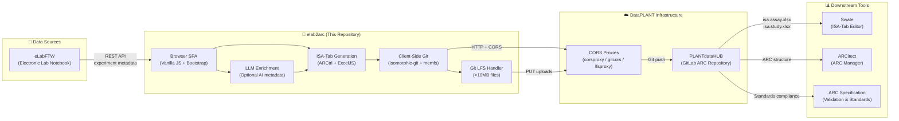

# elab2arc

**elab2arc** is a web-based Single Page Application (SPA) that bridges **eLabFTW** (an electronic lab notebook) and **PLANTdataHUB** (a GitLab-based Annotated Research Context (ARC) repository), enabling seamless synchronization of experimental metadata and raw data into **FAIR-compliant ARCs**.

https://github.com/user-attachments/assets/6223d4ec-fd46-4ddd-9bfa-9b0e4a9e780f

🔗 **Try it now**: [nfdi4plants.org/elab2arc/](https://nfdi4plants.org/elab2arc/)

---

## 🔍 Overview

Modern microbiological and life sciences research generates vast amounts of both metadata and raw datasets. Managing these across different tools — like ELNs for documentation and Git-based platforms for version control — can lead to fragmentation, manual errors, and poor compliance with FAIR (Findable, Accessible, Interoperable, Reusable) principles.

**elab2arc** automates the transformation of eLabFTW experiments into structured ARCs, ensuring reproducibility, traceability, and long-term data stewardship — all while requiring minimal user input.

---

## 🚀 Key Features

- ✅ **Web-based & Ready-to-use**: No installation needed — just open in your browser.
- 🔗 **Seamless Integration**: Connects **eLabFTW** and **PLANTdataHUB / DataHUB**.
- 📁 **Structured Data Conversion**: Converts experiments into standardized ARC format.
- 🧾 **ISA-Tab Metadata Generation**: Produces compliant metadata sheets for traceability.
- 🌐 **Dynamic URL Rewriting**: Ensures embedded image links work inside the ARC structure.
- 📁 **File Handling**: Manages binary files (images, FASTQs, etc.) and normalizes paths.
- 📥 **Batch Processing**: Select and convert multiple experiments at once.
- 💡 **Client-Side Git Operations**: Uses `isomorphic-git` for full Git functionality without backend dependencies.
- 🖥️ **Offline Filesystem Simulation**: Uses `memfs` for temporary file handling before committing.
- 🔐 **DataHUB Token Login**: Users can now log in via the NFDI4Plants DataHUB and get an access token directly within the app.
- 🤖 **LLM-Assisted Metadata Enrichment**: Optional AI-powered extraction of structured protocol metadata (samples, parameters, inputs/outputs) from free-text experiment descriptions.
- 📝 **Automated README Generation**: Generates README.md files for ARCs using LLM summarization.
- 📦 **Git LFS Support**: Automatically handles files larger than 10MB via Git Large File Storage.

---

## 📦 How to Use

### Quick Start

1. **Open the Tool**: Go to [nfdi4plants.org/elab2arc/](https://nfdi4plants.org/elab2arc/)
2. **Login**:
   - Enter your **eLabFTW API token**
   - Log in to **DataHUB** via the app to get your GitLab personal access token
3. **Select Experiments**:
   - Browse and select one or more experiments from your eLabFTW instance
4. **Transform to ARC**:
   - Let elab2arc automatically structure your metadata and files into a FAIR-compliant ARC
5. **Commit & Push**:
   - Review changes and push directly to your GitLab repository

A detailed user guide can be found in the [DataPLANT Knowledge Base](https://nfdi4plants.github.io/nfdi4plants.knowledgebase/resources/elab2arc/).

### Optional: Enable LLM Annotation

1. In the **Token** tab, configure an LLM provider:
   - **DataPLANT Community Server** (default, no key required)
   - **Together.AI** (requires API key)
   - **Local LLM** (LM Studio or Ollama)
2. During conversion, enable the **"LLM Annotation Table"** checkbox
3. The tool will extract structured protocol steps and generate multi-sheet ISA annotation tables

### File Explorer & Preview

Before committing changes, you can inspect the entire ARC structure inside the browser using the built-in **file explorer**.

- **Browse** the in-memory filesystem (powered by `memfs`) just like a local folder tree
- **Preview** files directly in the browser: Markdown renders as HTML, images display inline, and text files (JSON, CSV, ISA-Tab) open in a code viewer
- **Diff view** — Compare incoming changes against the remote ARC to see exactly what will be added, modified, or deleted before pushing
- **Download** individual files or the entire ARC as a ZIP archive

This lets you verify that metadata, protocols, and datasets were structured correctly without leaving the application.

### ARC README Generation

elab2arc can automatically generate `README.md` files for your ARC using an LLM. This produces human-readable documentation that summarizes the purpose, methods, and data overview of your experiments.

**Two-phase generation:**

1. **Child READMEs** — The LLM generates individual `README.md` files for each study and assay folder, based on the ISA metadata, protocol text, and file listings found in that folder.
2. **Root README** — The LLM produces a 2–3 sentence abstract for the entire ARC. elab2arc then assembles the root `README.md` deterministically by combining that abstract with a structured data overview and links to the child READMEs.

**Usage:** Click the **"📝 Generate READMEs"** button in the ARC tab after conversion. The generated files are staged in git alongside the ISA metadata and can be pushed with the rest of the ARC.

---

## 🏗️ Architecture & Ecosystem

elab2arc is part of the [NFDI4Plants](https://nfdi4plants.org/) / [DataPLANT](https://nfdi4plants.org/) research data management ecosystem. It sits between the electronic lab notebook (eLabFTW) and the ARC repository infrastructure (PLANTdataHUB), acting as a metadata bridge that ensures FAIR compliance without manual copy-pasting.

### Upstream Dependencies

| Component | Role | Repository / URL |
|-----------|------|-----------------|
| **eLabFTW** | Electronic Lab Notebook — source of experimental metadata | https://www.elabftw.net/ |
| **ARCtrl** | ISA-Tab/ARC data model and Excel serialization | https://github.com/nfdi4plants/ARCtrl |
| **isomorphic-git** | Client-side Git implementation for browser | https://isomorphic-git.org/ |
| **memfs** | In-memory filesystem for temporary ARC construction | https://github.com/streamich/memfs |
| **turndown** | HTML-to-Markdown conversion for protocol text | https://github.com/domchristie/turndown |

### Downstream / Related DataPLANT Repositories

| Component | Role | Repository / URL |
|-----------|------|-----------------|
| **PLANTdataHUB** / **DataHUB** | GitLab-based ARC repository for storage and versioning | https://git.nfdi4plants.org/ |
| **ARC Specification** | Standard defining the Annotated Research Context structure | https://nfdi4plants.github.io/arc-specification/ |
| **Swate** | Excel add-in for ISA-Tab annotation (can edit elab2arc outputs) | https://github.com/nfdi4plants/Swate |
| **ARCitect** | Desktop application for ARC creation and management | https://github.com/nfdi4plants/ARCitect |

### Ecosystem Diagram



---

## 🛠️ Development

### Prerequisites

- A modern web browser (Chrome, Firefox, Edge, Safari)
- Python 3.x **or** Node.js (for local HTTP server)
- (Optional) npm — for rebuilding the ARCtrl bundle

### Local Development Setup

Since elab2arc is a client-side SPA with no backend, you only need to serve the static files:

```bash
# Using Python
python -m http.server 8000

# Or using Node.js
npx serve

# Or using any static file server of your choice
```

Then open: http://localhost:8000/elab2arc/

> **Note:** For full functionality (Git push/pull, LFS uploads), the CORS proxies must be accessible. For local development without internet proxies, see the [CORS proxy setup notes](docs/Deployment-Guide-LFS-Proxy.md).

### Building the ARCtrl Bundle

The `js/arctrl.bundle.js` file is a webpack bundle that includes ARCtrl 3.0.1, memfs, and browser polyfills. To rebuild it after dependency updates:

```bash
cd js
npm install
npm run build
```

The bundle exposes these globals:
- `window.arctrl` — ARCtrl library (ARC, ArcAssay, ArcTable, Comment, etc.)
- `window.Xlsx` — Excel file handling (`fromXlsxFile`, `toFile`)
- `window.FS` — memfs in-memory filesystem (`{ fs }`)
- `window.ARC2JSON`, `window.newAssay`, `window.fullAssay` — Helper functions

> **Note:** memfs is pinned to `3.6.0` because v4+ uses `node:` prefixed imports that webpack 5 cannot resolve in browser environments.

### ISA-JSON Export

In addition to producing ARC-standard Excel files (`isa.investigation.xlsx`, `isa.study.xlsx`, `isa.assay.xlsx`), elab2arc can export a single combined **ISA-JSON** file that packages the entire investigation with all studies and assays in one JSON document.

**How it works:**

1. **Read investigation** — Loads the existing `isa.investigation.xlsx` from the in-memory ARC.
2. **Create overarching study** — Builds a single study object whose identifier matches the ARC name.
3. **Attach assays** — Reads every `isa.assay.xlsx` found under `assays/` and adds them to the overarching study.
4. **Register linkages** — Temporarily registers the study and its assays in the investigation (in memory only; the original Excel files are **not** modified).
5. **Serialize** — Converts the complete object graph to an ISA-JSON string using ARCtrl's `JsonController`.
6. **Post-process** — Runs `Elab2ArcEnrich.enrichIsaJson()` to fix common structural issues:
   - Ensures `publications`, `ontologySourceReferences`, `characteristicCategories`, `factors`, and `unitCategories` arrays exist
   - Infers missing `protocolType` annotations
   - Populates missing `executesProtocol` references on processes
   - Declares undeclared protocol parameters and material IDs
   - Removes orphaned or unused protocols, materials, and parameters

**Why this two-step approach?**

ARCtrl's Excel serializer has known issues when full study/assay objects (with nested materials and processes) are added directly to an investigation and then written back to `.xlsx`. To keep the ARC Excel files stable and valid, elab2arc **never** writes those complex linkages into `isa.investigation.xlsx`. The ISA-JSON export reconstructs those linkages on demand purely for the JSON output, leaving the underlying ARC unchanged.

**Usage:** Click the **"Export ISA-JSON"** button in the ARC tab after conversion. The JSON can be downloaded for submission to repositories, validation pipelines, or external tools that consume ISA-JSON natively.

### Project Structure

```
elab2arc/
├── index.html                    # Main SPA entry point
├── css/                          # Bootstrap 5 + custom styles
├── js/
│   ├── arctrl.bundle.js          # ARCtrl + memfs webpack bundle
│   ├── elab2arc-core20260504.js  # Core conversion orchestration
│   ├── git.js                    # Git operations wrapper
│   ├── http.js                   # HTTP utilities
│   ├── src/                      # ARCtrl bundle source
│   └── modules/
│       ├── isa-generation-*.js   # ISA-Tab/ISA-JSON generation
│       ├── isa-enrichment-*.js   # ISA-JSON post-processing fixes
│       ├── llm-service*.js       # LLM provider integration
│       ├── readme-generator*.js  # ARC README.md generation
│       ├── git-lfs-service.js    # Large file upload handling
│       ├── conversion-metadata.js# Conversion tracking
│       └── extra-fields-handler.js# Custom field processing
├── templates/                    # ISA Excel templates
├── docs/                         # Deployment & architecture docs
└── TESTING.md                    # Detailed testing guide
```

---

## 🧩 Built With

- **JavaScript**, **HTML5**, **CSS3**, **Bootstrap 5**
- **ARCtrl** – ISA-Tab metadata handling and ARC data model
- **isomorphic-git** – Client-side Git operations
- **memfs** – In-memory filesystem simulation
- **ExcelJS** – Excel file processing
- **turndown** – HTML-to-Markdown conversion

---

## 📄 License

This project is licensed under the **GNU General Public License v3.0** – see the [LICENSE](LICENSE) file for details.

---

## 📬 Contact

For questions, bug reports, or feature requests, please [open an issue](https://github.com/nfdi4plants/elab2arc/issues) on GitHub or reach out via [nfdi4plants.org](https://nfdi4plants.org).

---

## 🚀 Future Improvements

- Integration with other ELNs and RDM tools
- Enhanced LLM-assisted metadata structuring (multi-provider support already implemented)
- Support for RO-Crate and .ELN import/export formats
- Enhanced user authentication and error handling

---

**elab2arc** empowers researchers to streamline their workflows while adhering to modern data management standards. Start converting your experiments into FAIR-compliant ARCs today using the hosted version at [nfdi4plants.org/elab2arc/](https://nfdi4plants.org/elab2arc/)!
